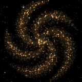

# Findastra Discord Presence

Show your friends which AI model you're using, live on your Discord profile: the exact model and effort level, the project you're working on, an elapsed timer, and a swirling galaxy that moves like a real one.

Two small Windows apps, one for each company's models. Run one or both; both cards can show at once.

| | |
|:---:|:---:|
|  |  |
| **Findastra Presence (OpenAI)** | **Findastra Presence (Anthropic)** |
| For **Codex** (GPT-6 Astra, GPT-5.6 Sol, …) | For **Claude Code** and the Claude app (Claude Opus 5.5, …) |
| **[⬇ Download for Windows](https://github.com/findastra/findastra-discord-presence/raw/main/downloads/findastra-presence-openai.zip)** | **[⬇ Download for Windows](https://github.com/findastra/findastra-discord-presence/raw/main/downloads/findastra-presence-anthropic.zip)** |

## Start it (about 2 minutes)

1. Install [Node.js 24 or later](https://nodejs.org/en/download) if you don't have it.
2. Download and unzip the app(s) you want.
3. Double-click **Start Findastra Presence.cmd** in the unzipped folder. Your browser opens its controls.
4. Click **Automatic**. Keep Discord desktop open, with activity sharing on in Discord's settings.
5. Optional: double-click **Enable Automatic Startup.cmd** once so it starts with Windows.

No account, API key or Discord setup needed. Everything runs on your own computer; nothing is sent anywhere except the card itself to your own Discord app. Details: [OpenAI app](openai/README.md) · [Anthropic app](anthropic/README.md).

## What the card shows

> **OpenAI**
> Using GPT-6 Astra on Ultra
> Working on paper-girl
> 00:42 elapsed

The title is the company; the line under it is the exact model and effort level. Your project (the folder you're working in) is opt-in. With several projects active, the card rotates through them every 15 seconds.

## The galaxies

Each galaxy has **one arm per model generation**: 6 for OpenAI (GPT-6) and 5 for Anthropic (Claude 5). When a new generation ships, its galaxy grows an arm. The animation follows real galaxy physics: stars near the core orbit several times faster than the rim, the arms trail, and stars brighten as they pass through an arm.

## Adding another AI

Each app is self-contained, so a new AI is a copy of one app folder with two parts changed:

1. **Detection** (`src/detector.js`): how to tell the AI is in use and which model, from local files only. Read the newest session or task metadata; never read conversation text.
2. **Labels** (`src/presence.js`): the card title, how model ids become friendly names, and a new built-in Discord application ID (create one in the [Discord Developer Portal](https://discord.com/developers/applications)).

Give it its own port (`src/server.js`, `src/launch.js`), startup file name (`src/windows-startup.js`, `scripts/startup.js`) and galaxy art (`public/`), add tests next to the existing ones, then add a column to the table above and a ZIP to `scripts/package.mjs`.

## For developers

```sh
cd openai && node --test        # or: cd anthropic
node scripts/package.mjs        # rebuilds both downloads in downloads/
```

No dependencies; Node.js 24 only. Rules for contributors (and AI assistants) are in [CLAUDE.md](CLAUDE.md).

This is an independent project, not made, endorsed or sponsored by OpenAI, Anthropic or Discord. Their names and model names are their trademarks and appear only to say which product you're using. The code is MIT-licensed; the galaxy art is original.
