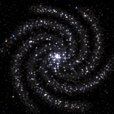

# Findastra Discord Presence

Share AI activity on your Discord profile: the model and effort level when local metadata exposes them, an optional project name, an elapsed timer, and a swirling galaxy.

Two small Windows apps, one for each company's models. Both can run together, but Discord may display only one card even when it accepts both activities. Each card was verified individually on Discord desktop; simultaneous display is not guaranteed.

| | |
|:---:|:---:|
|  |  |
| **OpenAI Discord Presence** | **Anthropic Discord Presence** |
| For **Codex** (GPT-6 Astra, GPT-5.6 Sol, …) | For **Claude Code** and the Claude app (Claude Opus 5.5, …) |
| **[⬇ Download for Windows](https://github.com/findastra/findastra-discord-presence/raw/main/downloads/openai-discord-presence.zip)** | **[⬇ Download for Windows](https://github.com/findastra/findastra-discord-presence/raw/main/downloads/anthropic-discord-presence.zip)** |

## Start it (about 2 minutes)

1. Install [Node.js 24 or later](https://nodejs.org/en/download) if you don't have it.
2. Download and unzip the app(s) you want.
3. Double-click **Start OpenAI Discord Presence.cmd** (or **Start Anthropic Discord Presence.cmd**) in the unzipped folder. Your browser opens its controls.
4. Click **Automatic**. Keep Discord desktop open, with activity sharing on in Discord's settings.
5. Optional: double-click **Enable Automatic Startup.cmd** once so it starts with Windows.

When updating, quit the running companion from its control panel before opening the new copy. The launcher checks the installation and build so an older process cannot silently stand in for the update. If you move the folder, enable startup again from the new location.

No account, API key or Discord setup needed. Everything runs on your own computer; nothing is sent anywhere except the card itself to your own Discord app. Details: [OpenAI app](openai-discord-presence/README.md) · [Anthropic app](anthropic-discord-presence/README.md).

## What the card shows

> **OpenAI**
> Using GPT-6 Astra on Ultra
> Working on paper-girl
> 00:42 elapsed

The title is the company; the line under it is the detected model and effort level when available. Your project (the folder you're working in) is opt-in. With several projects active, the card rotates through complete session records every 15 seconds, keeping each project paired with its own model and effort.

Codex and Claude Code expose model metadata. Claude desktop chat does not expose an exact model to this companion, so it shows **Using Claude**. OpenAI manual sessions with no recent model metadata show **Using OpenAI**. Automatic detection follows recent metadata or an open Claude desktop app, not foreground focus. An accepted Discord activity is not proof that the profile displays it.

## The galaxies

Each galaxy has **one arm per model generation**: 6 for OpenAI (GPT-6) and 5 for Anthropic (Claude 5). When a new generation ships, its galaxy grows an arm. The animation follows real galaxy physics: stars near the core orbit several times faster than the rim, the arms trail, and stars brighten as they pass through an arm.

## Adding another AI

Want a card for Gemini, Copilot or another model? Each app is a self-contained folder, so a new one is a copy of an existing app with its detection, labels, Discord application and galaxy changed. Step-by-step guide: **[ADDING-A-MODEL.md](ADDING-A-MODEL.md)**.

## For developers

```sh
node --test                     # every app's tests plus the naming rules
node scripts/package.mjs        # rebuilds the downloads in downloads/
```

No dependencies; Node.js 24 only. Rules for contributors (and AI assistants) are in [CLAUDE.md](CLAUDE.md).

This is an independent project, not made, endorsed or sponsored by OpenAI, Anthropic or Discord. Their names and model names are their trademarks and appear only to say which product you're using. The code is MIT-licensed; the galaxy art is original.
